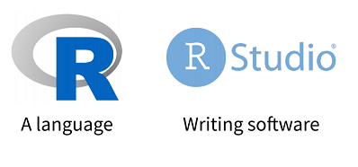

<style type="text/css">

slides > slide:before {
  font-size: 12pt;
  content: 'http://shiny.rstudio.com/';
  position: absolute;
  text-align: center;
  bottom: 15px;
  left: 50%;  
  margin-left: -300px;
  width: 600px;
  line-height: 1.9;
}

div.img-col{
  text-align: center;
  font-size: 14pt;
}

a {
  border-bottom: none !important;
}

.wrapper {
  margin: 70px auto;
  position: relative;
  z-index: 90;
}

.ribbon-wrapper-green {
  width: 145px;
  height: 148px;
  overflow: hidden;
  position: absolute;
  top: -3px;
  right: -3px;
}

.ribbon-green {
  font: bold 15px Sans-Serif;
  color: #333;
  text-align: center;
  text-shadow: rgba(255,255,255,0.5) 0px 1px 0px;
  -webkit-transform: rotate(45deg);
  -moz-transform:    rotate(45deg);
  -ms-transform:     rotate(45deg);
  -o-transform:      rotate(45deg);
  position: relative;
  padding: 7px 0;
  left: -25px;
  top: 45px;
  width: 220px;
  background-color: #7ADCBF;
  background-image: -webkit-gradient(linear, left top, left bottom, from(#8AACDF), to(#658FBE)); 
  background-image: -webkit-linear-gradient(top, #8AACDF, #658FBE); 
  background-image:    -moz-linear-gradient(top, #8AACDF, #658FBE); 
  background-image:     -ms-linear-gradient(top, #8AACDF, #658FBE); 
  background-image:      -o-linear-gradient(top, #8AACDF, #658FBE); 
  color: #6a6340;
  -webkit-box-shadow: 0px 0px 3px rgba(0,0,0,0.3);
  -moz-box-shadow:    0px 0px 3px rgba(0,0,0,0.3);
  box-shadow:         0px 0px 3px rgba(0,0,0,0.3);
}

.ribbon-green:before, .ribbon-green:after {
  content: "";
  border-top:   3px solid #00896e;   
  border-left:  3px solid transparent;
  border-right: 3px solid transparent;
  position:absolute;
  bottom: -3px;
}

.ribbon-green:before {
  left: 0;
}
.ribbon-green:after {
  right: 0;
}
</style>


## Things You Should Know
- There are no stupid questions & let go of our egos
- Because we have limited time, please write down questions as they occur to you, and then ask them when the instructor pauses for questions
- You will not learn all of R today
- Don't be afraid to experiment and try things out: you won't blow up anything important if you make a mistake
- Red is an Action Item for you
- Speed is the name of the game – fastest way to get you started

## Your Turn 3 Mins

<div class="red2"> 

- Form groups of 2-4 people. Introduce yourself to your
group members. Tell them:
- Who you are
- What you do with data
- How long you have been using R

</div>

# Workshop Outline

## Outline

### We'll Cover Four Main Areas:
<div class="columns-2">
- Tidyverse
- Shiny
- R Markdown
- htmlwidgets for R
- If time:
- Deploying via Shiny Server & RStudio Connect
- DB packages: dplyr, DBI, odbc
- APIs via plumber

<div class="img-col">

   
 </div>
</div>

## My Story & How I Got Here
### About:
 - CS Background
 - B2S Life Sciences
 - Book Note - Statistical Methods for Immunogenicity Assessment
 

# Biopharmaceuticals

## Top 10 U.S. Drugs

- https://en.wikipedia.org/w/index.php?title=List_of_largest_selling_pharmaceutical_products
- https://www.fiercepharma.com/special-report/top-20-drugs-2020-worldwide-sales
- Monoclonal antibodies now comprise the predominant category of the biotherapeutics undergoing development

## Protein Drugs – Increased Size... Results in Increased Complexity

- Unlike traditional small molecule drugs, they posses a high ordered structure
- Oxytocin 1,007 Da
- Insulin 5,808 Da
- Therapeutic mAb 150,000 Da
- Safety and Efficacy concerns, Assessment of Biosimilarity
- Monoclonal, Polyclonal Antibody

## What is Immunogenicity?
- Immunogenicity is characterized by the presence of antidrug antibodies (ADAs) detected in the circulation of either animals or humans after administration of a biopharmaceutical
- Ability of an agent to provoke an immune response
- Traditional small molecule drugs rarely elicit formation of antibodies
- Repeated administration of biotech drugs frequently results in unwanted formation of ADA (anti-drug Abs)
- Two types: “Wanted” -> Vaccines & “Unwanted” -> ADA (anti-drug Abs) [Van Beers et al. 2010]
- Therapeutic use of monoclonal antibodies is often associated with immunogenicity (Remicade USPI 2015)

## FDA’s Immunogenicity Draft Guidance (Dec. 2009)
- https://www.fda.gov/downloads/Drugs/Guidances/UCM192750.pdf
- Evaluating the immunogenicity of biopharmaceuticals is mandatory for regulatory approval


## Tiered Process - Testing Scheme for Detection & Characterization of ADA

<div class="columns-4"></a>

</div>

## Tiered Process

- Tier 1: Identify “reactive” samples: Samples with signal above screening cut-point
- Tier 2: Identify “Ab+” samples by testing reactive samples in the absence and presence of drug: Samples with percent inhibition above confirmatory cut-point
- Tier 3: Determine a sample titer value by serial dilution of Ab+ samples in Tier 2: Titer is based on the screening cut-point or a higher “titer cut-point”. Can be continuous (requires interpolation) or discrete
- Tier 4: Evaluate neutralizing effects of antibodies: Usually based on cell-based bioassay using Ab+ samples


## Schaarschmidt et al - R!

- Statistical approaches for the determination of cut points in anti-drug antibody bioassays
- https://www.ncbi.nlm.nih.gov/pubmed/25733352
- "All methods discussed are available in the corresponding R add-on package mixADA"
- Normalization assuming normal and log-normal distribution 
- Testing normal vs. log-normal distribution in the mixed model
- "Therefore, our approach, which is mirrored in mixADA software, is a parallel estimation of the SCP assuming an underlying normal and log-normal distribution"
- "Specific R algorithms were provided and summarized in the user-friendly program mixADA, providing diagnostic tools and optional model choice"


## Shankar & Co-workers 2014 & 2015 Reporting
- https://www.ncbi.nlm.nih.gov/pmc/articles/PMC4070270/
- https://www.ncbi.nlm.nih.gov/pubmed/25850051


## NDA's & R

- Review clin/pharm sections of NDA's with R graphics/analyses
- R in Clin pharm for nonlinear mixed effects modeling and subsequent graphical analysis
- https://www.accessdata.fda.gov/drugsatfda_docs/nda/2016/208573Orig1s000ClinPharmR.pdf
- https://www.accessdata.fda.gov/drugsatfda_docs/nda/2017/209296Orig1s000ClinPharmR.pdf
- https://channel9.msdn.com/Events/useR-international-R-User-conference/useR2016/Using-R-in-a-regulatory-environment-FDA-experiences
- https://uupharmacometrics.github.io/xpose/
- https://cran.r-project.org/web/views/ClinicalTrials.html
- https://www.r-project.org/doc/R-FDA.pdf
- https://github.com/andyofsmeg/RValidation
- http://washstat.org/presentations/20181024/Schuette.pdf

 
## Freedom to Build... 

- “This is your world...You’re the creator...Find freedom on this canvas...Believe, that you can do it, ‘Cuz you can do it. You can do it. Bob Ross"
- The Karate Kid
- Hungry & Passionate
- Focus on what students want to do
- Activate Learning
- Project based learning
- Mental Models
- Cognitive Load
- "I have always been inspired by those who can capture the landscape with a minimum of brushstrokes"

## Goal of Workshop

<div class="columns-4"></a>

</div>

- Target Audience
- Goal of session

</div>

## Self Assessment

<div class="red2"> 

- If interested...
- https://shiny.rstudio.com/tutorial/quiz/

</div>

# Part 1 Setup


## Setup in RTT

- https://github.com/sol-eng/classroom-getting-started
- R & Python (https://solutions.rstudio.com/python/overview/)
- Packages (Shiny, Tidyverse, RMD)
- IDE
- Projects
- Sessions
- [Git](https://rstudio-pubs-static.s3.amazonaws.com/443271_e3d08417368642e19588f0bbdede90d7.html#(16))/Github (https://happygitwithr.com/)
- RStudio Connect
- Shiny
- Repeatable & Reproducible
- [FDA](http://washstat.org/presentations/20181024/Schuette.pdf)


## How Do I Use R After Workshop?

<div class="columns-2">

- R Review ... [rstudio.cloud](https://rstudio.cloud/)
- Not an R Intro but also No prior knowledge of Shiny or RMD is needed
- [R](https://cran.r-project.org/)
- [R Packages](https://cran.r-project.org/web/packages/available_packages_by_name.html)
- [RStudio](https://www.rstudio.com/products/rstudio/download/#download)
- [RStudio Server](https://www.rstudio.com/products/rstudio/download-server/)
- [RStudio Cloud](https://rstudio.cloud/projects)
- [Installation](https://www.linkedin.com/pulse/installing-r-rstudio-windows-edgar-ruiz/)
- [Intro](https://grunwaldlab.github.io/metacoder_documentation/appendix--00--intro_to_rstudio.html)

<div class="img-col">

   
 </div>
</div>

## Creating a Training Environment & Sandbox for IT

<div class="columns-2">
- [RStudio Server](https://www.edgarsdatalab.com/2017/11/24/setup-an-rstudio-server-in-ubuntu/)
- [Shiny Server](https://www.edgarsdatalab.com/2016/08/25/setup-a-shiny-server-in-aws/)
- [Quick Start](https://rstudio.com/products/quickstart/)
- [Sandbox](https://rviews.rstudio.com/2018/08/23/learning-analytic-administration-through-a-sandbox/)

<div class="img-col">

   
 </div>
</div>


## Setup & Quick Intro

- Panes
- Buttons
<td></td>
</tr>
</table>

## By the Way, Books...
- https://mastering-shiny.org/
- http://r4ds.had.co.nz & https://rstudio.cloud/
- https://r-graphics.org/
- http://www-bcf.usc.edu/~gareth/ISL/
- http://appliedpredictivemodeling.com/
- https://bookdown.org/yihui/rmarkdown/
- https://www.tidytextmining.com/
- https://adv-r.hadley.nz/

# Genius of R Markdown...

## Part 2.0 - R Notebooks

<div class="columns-2">
- [Notebooks](http://rmarkdown.rstudio.com/r_notebooks.html)
- [Notebook Background](https://rviews.rstudio.com/2017/03/15/why-i-love-r-notebooks/)
- [Using rmarkdown and parameterised reports Mike K Smith](https://resources.rstudio.com/rstudio-conf-2019/the-lazy-and-easily-distracted-report-writer-using-rmarkdown-and-parameterised-reports)
- Leonardo da Vinci…Page from the Codex Atlanticus shows notes and images about water wheels and Archimedean Screws
- Combine in a single document: Narrative, Code, Output & then Render to HTML

<div class="img-col">
<a href="https://blog.rstudio.com/2016/10/05/r-notebooks/"></a>

</div>

## Part 2.0 - R Notebooks cont.

<div class="columns-2">
- Number 3: Notebooks are for doing science
- Number 2: R Notebooks have great features
- Number 1: R Notebooks make it easy to create and share reports
- http://r4ds.had.co.nz/r-markdown-workflow.html
- 3_RMD_Notebook_Tidyverse

<div class="img-col">
<a href="http://rmarkdown.rstudio.com/r_notebooks.html#saving_and_sharing"></a>

</div>

## Setup Chunk

- The setup chunk is always run once before anything else
and is a great place to load packages

<div class="columns-4"></a>

</div>

## nlmixr info nlmixr-overview_Page2019.pptx

<div class="columns-4"></a>

</div>

## Example Model on Theo

- 2_nlmixr_notebook.Rmd
- Compare to Run1.R

# Great Job, quick break

## theo_sd data, Multiple Dose Theophiline PK Data

<div class="red2"> 

- Day 1 concentrations of the [Theophiline data](https://www.rdocumentation.org/packages/nlmixr/versions/1.0.0-7/topics/theo_sd) that is included in nlmixr
- library(nlmixr)
- data(theo_sd)
- ?theo_sd
- theo_sd
- View(theo_sd)
- summary(theo_sd)
- plot(theo_sd)
- theo_sd %>% View('TD')
- Any errors?

</div>


# Tidyverse

## Tidyverse is a...
- opinionated collection of R packages designed for data science
- coherent system of packages for data manipulation, exploration and visualization that share a common design philosophy
- set of packages that work in harmony because they share common data representations and API design
- a package of packages that...
- share an underlying design philosophy, grammar, and data structures
- https://www.tidyverse.org/

## R for Data Science

- [Tools needed in a typical data science project](http://r4ds.had.co.nz/introduction.html)
- https://github.com/rstudio/RStartHere

<div class="columns-4"></a>

</div>

## That looks really close to...

<div class="columns-4"><a href="http://clinicalsastrainingonline.com/cdisc-sdtm-and-adam-online-training/"></a>

</div>


## So Why the Error?... Managing-libraries
- library(tidyverse)
- https://support.rstudio.com/hc/en-us/articles/215733837-Managing-libraries-for-RStudio-Server
- https://cran.r-project.org/doc/manuals/r-release/R-admin.html#Managing-libraries
- "@ijlyttle a package is a like a book, a library is like a library; you use library() to check a package out of the library" #rsats — Hadley Wickham (@hadleywickham) December 8, 2014
- https://environments.rstudio.com/reproduce.html


## Packages...
- getwd()
- installed.packages()
- .libPaths()
- Install a package...how about one from here:
- https://gallery.shinyapps.io/087-crandash/
- User library
- System library
- https://juliasilge.com/blog/navigating-packages/
- [How do I select an R package for my clinical workflow?](https://www.phusewiki.org/docs/2019%20US%20Connect%20Final%20Papers/TT/how-do-i-pick-an-r-package-for-my-clinical-workflow-bowsher-lopp-20454.pdf)


## FIRST THINGS FIRST…DATA

- Read	in	data	with	readr,	haven,	readxl
- readr (read_csv(),	read_tsv(),	read_delim())
- haven (read_sas(),	read_spss(),	read_stata(),	read_dta())
- readxl (read_xls(),	read_xlsx(),	read_excel())

## IDE PICK A DATASET in Data Folder

- Built-in datasets like Sashelp Data Sets
- data()
- theo_sd
- starbucks
- ADA
- ToothGrowth

## Import Dataset via GUI

- Click on theo_sd.csv in nlmixr folder
- Click Import Dataset...Remember to click update
- Copy that code

<div class="columns-4"></a>

</div>

## Let us explore the data set a bit

<div class="red2"> 

- theo_sd %>% write_csv(‘theo_sd2.csv’)
- theo_sd2 <-read_csv(“theo_sd2.csv”)
- names(theo_sd) # names of the variables
- dim(theo_sd) # dimension (number of rows and columns)
- str(theo_sd) # structure of the data set
- class(theo_sd)
- head(theo_sd, n = 5)
- tail(theo_sd, n = 5)

</div>


## Empowered to Build Powerful Visualizations, Reports & Apps
- ["R is a fantastic environment for the rapid exploration of in-memory data"](https://peadarcoyle.wordpress.com/2015/08/02/interview-with-a-data-scientist-hadley-wickham/)
- https://www.go-acop.org/previous-acop-meetings-acop7-posters


## Live Data Visualization Pharma Tools/Apps
- http://webpopix.org/shiny/ShinyExamples.html
- https://gallery.shinyapps.io/genome_browser/
- https://www.bioconductor.org/packages/release/data/experiment/vignettes/RforProteomics/inst/doc/RProtVis.html
- http://omimexplorer.research.bcm.edu:3838/omim_explorer/
- https://canvasxpress.org/html/index.html

## Common Reporting Tasks - ggplot2

<div class="columns-2">
- [Plotting system for R](https://rpubs.com/hadley/ggplot2-toolbox)
- [Created by Hadley Wickham](http://ggplot2.org/)
- [Powerful graphics language for creating elegant and complex plots](http://www.cookbook-r.com/Graphs/)
- [ggplot2 is a graphing library for R. Use ggplot2 with Plotly to create interactive, online ggplot2 charts with D3.js.](https://plot.ly/ggplot2/)
- [ggvis is a data visualization package for R](http://ggvis.rstudio.com/)

<div class="img-col">
<a href="https://ramnathv.github.io/pycon2014-r/visualize/ggplot2.html"></a>


</div>

## A ggplot2 template - Make any plot by filling in the parameters of this template

```{r}
#ggplot(data = <DATA>) +
#<GEOM_FUNCTION>(mapping = aes(<MAPPINGS>))
```

```{r fig.height = 3, fig.width = 5}
library(ggplot2)
ggplot(data = mpg) +
geom_point(mapping = aes(x = displ, y = hwy))
```

## Theo example
```{r, message=FALSE}
library(ggplot2)
library(readr)
theo_sd <- read_csv("theo_sd.csv")
ggplot(theo_sd) +
geom_line(mapping = aes(x = TIME, y = DV))

```


## Tools that build on ggplot2
- https://radiant-rstats.github.io/docs/
- https://www.bioconductor.org/packages/devel/bioc/vignettes/bioCancer/inst/doc/bioCancer.html
- https://uupharmacometrics.github.io/xpose/articles/cheatsheet.pdf
- https://github.com/gertstulp/ggplotgui


##  Visualizations using Esquisse

- RStudio add-in to make plots with ggplot2

<div class="columns-4"></a>

</div>


## Your Turn 3 Mins 

<div class="red2"> 

- Take your data import code and visualization code and insert it into a notebook
- Import theo_sd
- Explore with Esquisse
- Rpubs
- 1_Intro_Notebook.Rmd in nlmixr folder has examples but try to make your own

</div>

# Great Job, quick break


## DATATYPES
- R has a wide variety of data types…
- Vectors
- Lists
- Matrix
- Factors
- Data frame
- Tibble
- Is theo_sd a Tibble? Hint: class(theo_sd)

## WHAT I LIKE ABOUT TIBBLES..

<div class="columns-2">
- The pet cat -no
- Timmy and Tommy Tibble –no, but my kids do…
- An awesome data set format for R: yes
- [Tibble info](http://colorado.rstudio.com/rsc/content/678/tidyverse_notebook.nb.html)

 <div class="img-col">
   
   
   <div>CC image courtesy <br /> of <a href="http://pbskids.org/arthur/friends/tibbles/photos.html">pbskids</a> arthur</div>
 </div>
</div>

## Tribbles!..

<div class="columns-2">
- Another way to create a tibble is with tribble(), short for transposed tibble
- http://r4ds.had.co.nz/tibbles.html

 <div class="img-col">
   
   
   <div>CC image courtesy CBS Home Entertainment<br /> of <a href="http://www.treknews.net/2017/07/31/star-trek-discovery-tribbles-pg13/">The Trouble </a> With Tribbles</div>
 </div>
</div>

- Darn quadrotriticale

## Tibble Example like DATALINES

```{r}
library(tibble)
#library("tidyverse")
storms <-tribble(
~storm, ~wind, ~pressure, ~date,
"Alberto", 110, 1007, "2000-08-12",
"Alex", 45, 1009, "1998-07-30",
"Allison", 65, 1005, "1995-06-04",
"Ana", 40, 1013, "1997-07-01",
"Arlene", 50, 1010, "1999-06-13",
"Arthur", 45, 1010, "1996-06-21"
)

# filter(storms, wind == 45)

```

## theo_sd as a Tibble
- library(readr) theo_sd <- read_csv(“theo_sd2.csv”)
- class(theo_sd)
- How about now?


## Tidy Data

<td></td>
</tr>
</table>


## Remember dplyr single table verbs 

- filter() extract cases
- arrange() reorder cases
- group_by() group cases
- select() extract variables
- mutate() create new variables
- summarise() summarise variables / create cases

## Remember tidyr single table verbs 

- pivot_wider() move values into column names
- pivot_longer() move column names into values
- separate() separate variables that share a column
- unite() unite a variable that is split across several columns

## The pipe operator %>%
- http://r4ds.had.co.nz/pipes.html
- Passes result on left into first argument of function on right
- And then
- mutate(babynames, percent = prop * 100)
- babynames %>% mutate(percent = prop * 100)
- https://nlmixrdevelopment.github.io/nlmixr/articles/modelPiping.html

## Pipes

<td></td>
</tr>
</table>


## AE Influence
- https://www.bassconference.org/tutorials/BASS%202018%20Munsaka.pdf
- https://dpastoor.github.io/bayesiantutorial/demographics-background.html
- https://www.lexjansen.com/phuse/2018/dv/DV11.pdf
- https://www.lexjansen.com/phuse/2018/dv/DV11_ppt.pdf
- https://github.com/RhoInc/aeplot
- https://github.com/RhoInc/RStudioConf2019-ePoster/
- https://github.com/SafetyGraphics/safetyGraphics
- https://www.pharmasug.org/proceedings/china2018/SS/SS03.pdf

## Clinical Example statistical_programming_examples
- https://towardsdatascience.com/a-gentle-guide-to-statistics-in-r-ccb91cc1177e
- http://rpubs.com/jtmock/tidy-stats-in-R
- https://resources.rstudio.com/tidyverse/a-gentle-introduction-to-tidy-statistics-in-r


## Collecting Information About Your R Session...
- writeLines(capture.output(sessionInfo()), "sessionInfo.txt")
- writeLines(capture.output(devtools::session_info()), "devsessionInfo.txt")
- packageVersion("tidyverse")
- https://support.rstudio.com/hc/en-us/articles/219949047-Installing-older-versions-of-packages
- http://manishbarnwal.com/blog/2016/10/05/install_a_package_particular_version_in_R/
- https://github.com/r-lib/sessioninfo
- https://support.rstudio.com/hc/en-us/articles/360002242413-Multiple-versions-of-R
- https://github.com/elbersb/tidylog


# Great Job, quick break


# Shiny

## Shiny Motivation

<div class="columns-2">
 - Analysis must be communicated
 - Data scientists are modern diviners
 - We sit between the tools and users
 - Deliver static reports
 - Impoverished perspective into analysis
 - https://github.com/jcheng5
 - https://www.youtube.com/watch?v=elG0gvnaSIs

 <div class="img-col">
   
   
   <div>Altered CC image courtesy <br /> of <a href="https://www.flickr.com/photos/mcgraths/">mcgraths</a> on flickr</div>
 </div>
</div>

## Live Shiny Pharma Examples

<div class="columns-2">
- [Build your PK model by Marc Lavielle using the mlxR package at http://simulx.webpopix.org/ ](http://shiny.webpopix.org/dashboard/pkmodel/) & [here](http://webpopix.org/shiny/ShinyExamples.html)
- [medplot by Crt Ahlin & Lara Lusa to  facilitate the exploration and analysis of longitudinal data](http://shiny.mf.uni-lj.si/medplot/)
- [Bioequivalence v0.3 by Andrey Ogurtsov](https://statist.shinyapps.io/bioeq_en/)

<div class="img-col">

   
 </div>
</div>


## Shiny
### About:
 - Interactive web application framework for R
 - Create and share applications with others
 - Expects no knowledge of web technologies like HTML, CSS, or JavaScript (but you can leverage them, if you know them)

### Benefits & Features:
 - Accessible to non-programmers
 - Great for exploratory data analysis, visualizations & dashboards
 - Utilize existing R code
 
## Using Shiny - How to Build a shiny App & Installation & Structure 
 - A shiny app consists of two parts: a user interface (UI) and a server
 - Install Package - Shiny - install.packages("shiny")
 - Load Library - Shiny - library(shiny)
 - ui.R - User Interface
 - server.R  - Server Function
 - File Template - runExample("01_hello")
 - [Shiny Cheat Sheet](http://shiny.rstudio.com/articles/cheatsheet.html)
 - [Enhance with Shiny functions and R code](http://shiny.rstudio.com/reference/shiny/latest/)
 - [Enhance with Shiny Widgets](http://shiny.rstudio.com/gallery/widget-gallery.html)

## Core Concepts
- Panels
- https://shiny.rstudio.com/articles/build.html
- http://shiny.rstudio.com/tutorial/written-tutorial/lesson2/

## Your Turn 3 Mins

<div class="red2"> 

- Create a new Shiny app in the IDE by going to 'File' and select 'New File' and select 'Shiny Web App'
- Select Multiple File
- Name it yournameShiny
- Review Code

</div>

## Intro Process 
 - http://shiny.rstudio.com/gallery/
 - theo_sd
 - http://shiny.rstudio.com/gallery/basic-datatable.html
 - http://www.pharmasug.org/proceedings/2018/AD/PharmaSUG-2018-AD24.pdf
 - http://www.pharmasug.org/proceedings/2016/DG/PharmaSUG-2016-DG10.pdf
 - https://www.phusewiki.org/docs/CSS2015Presentations/PP26FINAL.pdf
 - https://www.pharmasug.org/proceedings/2019/AD/PharmaSUG-2019-AD-048.pdf
 
## Your Turn 5 Mins Shiny Development Example - 1_Shiny_nlmixr_Basic 
<div class="red2"> 

- Go [here](http://shiny.rstudio.com/gallery/basic-datatable.html)
- Create a new multi file shiny app in the IDE by going to 'File' and select 'New File' and select 'Shiny Web App...' and create a new multiple file app and title it 'Statshiny' (or use the one you already created)
- Copy over the ui.R and app.R files with the code found [here:](https://github.com/rstudio/shiny-examples/tree/master/030-basic-datatable)
- Click 'Run App' in the IDE when done
- See if you can get it to work with the theo_sd Data
- Github circle

</div>

## Example shiny App &mdash; `ui.R`

```r
library(DT)
library(readr)

theo_sd <- read_csv("theo_sd.csv")

fluidPage(
  titlePanel("Basic DataTable for Theophiline"),
  
  
  # Create a new Row in the UI for selectInputs
  fluidRow(
    column(4,
           selectInput("CMT",
                       "Compartment Number:",
                       c("All",
                         unique(as.character(theo_sd$CMT))))
    )
    )
  ,
  # Create a new row for the table.
  fluidRow(
    DT::dataTableOutput("table")
  )
)
```

```{r, echo=FALSE, results="hide"}
library(datasets)
head(iris, n=2)
```


## Example shiny App &mdash; `server.R`

```r
library(readr)

function(input, output) {
  
  # Filter data based on selections
  output$table <- DT::renderDataTable({
    DT::datatable({
    data <- read_csv("theo_sd.csv")
    if (input$CMT != "All") {
        data <- data[data$CMT == input$CMT,]
    }
    
    data
    
  },
      
  filter = list(position = 'top', clear = FALSE),
  options = list(pageLength = 15), 
  rownames = FALSE)
  })
  
}
```
## Shiny Development Example

- 1_Shiny_nlmixr_Basic in nlmixr folder


## theo_sd Exploratory Plots
Let’s Create the Exploratory Plots from Before in Shiny
http://shiny.rstudio.com/gallery/single-file-shiny-app.html


## Shiny Example - Interactive Plot theo_sd 2_Shiny_nlmixr_plot
```{r, echo=FALSE, message=FALSE}
library(ggplot2)
library(readr)
library(Cairo)   # For nicer ggplot2 output when deployed on Linux

data <- read_csv("theo_sd.csv")

ui <- fluidPage(
    fluidRow(
        column(width = 6,
               plotOutput("plot1", height = 350,
                          click = "plot1_click",
                          brush = brushOpts(
                              id = "plot1_brush"
                          )
               ),
               actionButton("exclude_toggle", "Toggle points"),
               actionButton("exclude_reset", "Reset")
        )
    )
)

server <- function(input, output) {
    # For storing which rows have been excluded
    vals <- reactiveValues(
        keeprows = rep(TRUE, nrow(data))
    )
    
    output$plot1 <- renderPlot({
        # Plot the kept and excluded points as two separate data sets
        keep    <- data[ vals$keeprows, , drop = FALSE]
        exclude <- data[!vals$keeprows, , drop = FALSE]
        
        ggplot(keep, aes(TIME, DV, color = factor(ID))) + geom_point() + 
            stat_smooth(aes(color = NULL), size = 1.3) +
            geom_point(data = exclude, shape = 21, fill = NA, color = "black", alpha = 0.25) +
            coord_cartesian(xlim = c(0, 25), ylim = c(0,15))
    })
    
    # Toggle points that are clicked
    observeEvent(input$plot1_click, {
        res <- nearPoints(data, input$plot1_click, allRows = TRUE)
        
        vals$keeprows <- xor(vals$keeprows, res$selected_)
    })
    
    # Toggle points that are brushed, when button is clicked
    observeEvent(input$exclude_toggle, {
        res <- brushedPoints(data, input$plot1_brush, allRows = TRUE)
        
        vals$keeprows <- xor(vals$keeprows, res$selected_)
    })
    
    # Reset all points
    observeEvent(input$exclude_reset, {
        vals$keeprows <- rep(TRUE, nrow(data))
    })
    
}

shinyApp(ui, server)
```

## Let's Repeat Process with theo_sd

## Shiny Development Example - 2_Shiny_nlmixr_ggplot2

<div class="columns-2">
- [Example 1](http://shiny.rstudio.com/gallery/plot-plus-three-columns.html)

</div>

## Let's Repeat Process with SAS AE Dataset
<div class="red2"> 
- statistical_programming_examples
- https://shiny.rstudio.com/articles/scoping.html
- [global.r](https://mraess.netlify.com/2018/07/the-awesomeness-that-is-the-global-r-file-or-how-to-clean-up-your-shiny-app/)
- https://shiny.rstudio.com/articles/dynamic-ui.html
</div>

## Trick to get more examples
- Don't have to copy paste
- https://github.com/rstudio/shiny-examples/
- Github circle


## You Need a Dashboard!

<div class="columns-4"></a>

</div>

# shinydashboard

## shinydashobard information 

- [How to develop a Shiny dashboard](http://db.rstudio.com/best-practices/dashboards/)
- [Intro to dashboards](https://github.com/rstudio/bigdataclass2018/blob/master/assets/workbook/09-dashboards.Rmd)
- [shinydashboard](https://rstudio.github.io/shinydashboard/)
- [Material design in Shiny apps](https://ericrayanderson.github.io/shinymaterial/)
- https://rviews.rstudio.com/2018/03/13/alternative-design-for-shiny/
- https://www.rstudio.com/resources/videos/dashboards-made-easy/
- https://github.com/RinteRface/shinydashboardPlus

## Shiny Development Example - 4_Shiny_shinydashboard_basic

- [Pharmacometrics: some Shiny applications](http://webpopix.org/shiny/ShinyExamples.html)
- [CDC PrEP Guidelines](https://prism.shinyapps.io/cdc-prep-guidelines/)
- [CDC Zika Data](https://chendaniely.shinyapps.io/zika_cdc_dashboard/)
- 4_Shiny_shinydashboard_basic
- https://richardhooijmaijers.github.io/shinyMixR/index.html

## shinyMixR

- https://richardhooijmaijers.github.io/shinyMixR/index.html


## Shiny Development Example - 4_Shiny_Immunogenicity_3Tier

- shinydashboard
- https://github.com/rstudio/bigdataclass2018/blob/master/assets/workbook/09-dashboards.Rmd
- ADA three‐tiered testing strategy is deployed to assess ADA on sample data.
- [Example](https://beta.rstudioconnect.com/content/2769/)
- http://www.covance.com/content/dam/covance/assetLibrary/whitepapers/adawhitepaperpdf.pdf

## Shiny Development Example - 4_Shiny_Immunogenicity_htmlTemplate

- Simple Immunogenicity report via Shiny html template
- [HTML Templates](http://shiny.rstudio.com/articles/templates.html)
- [Developing and deploying large scale Shiny applications ](https://channel9.msdn.com/Events/useR-international-R-User-conferences/useR-International-R-User-2017-Conference/Developing-and-deploying-large-scale-Shiny-applications-for-non-life-insurance)
- [Example](https://beta.rstudioconnect.com/content/2771/)
- https://rinterface.com/


# Deploy

## So where can I deploy my Shiny app? 
- shinyapps.io
- Shiny Server
- RStudio Connect beta.rstudioconnect.com

## shiny Package & Shiny Server/RStudio Connect

<table width="100%" style="border-spacing: 50px; border-collapse: separate; margin: -50px auto;">
<tr>
<td style="vertical-align: top; padding-top: 1em">
### shiny Package
Shiny is an open source R package that provides a web framework for building interactive web applications using R.
</td>
<td></td>
</tr><tr>
<td style="vertical-align: top; padding-top: 1em">
### RStudio Connect & Shiny Server
Server program that lets you host and manage shiny web applications and interactive documents online.
</td>
<td></td>
</tr>
</table>

## Deploy as a Package/Shiny Gadget
- https://www.r-statistics.com/2016/11/ggedit-interactive-ggplot-aesthetic-and-theme-editor/
- [Shiny Gadgets](https://github.com/philbowsher/RStudio-Addins-Shiny-Gadgets)
- https://github.com/calligross/ggthemeassist
- https://will-landau.com/2016/11/01/appPackage/
- https://github.com/dreamRs/esquisse
</div>

## Your Turn 3 Mins

<div class="red2"> 

- Deploy yournameShiny
- Make a change to app
- [Step 6: Open RStudio Connect](https://github.com/sol-eng/classroom-getting-started)

</div>

## Debugging not covered

- https://rpubs.com/jmcphers/shiny-debugging
- https://shiny.rstudio.com/articles/debugging.html
- Please note you can use profvis with Shiny apps. Here is an example: http://rstudio.github.io/profvis/examples.html#example-3---profiling-a-shiny-application
- https://support.rstudio.com/hc/en-us/articles/218221837-Profiling-with-RStudio
- https://www.rstudio.com/resources/videos/debugging-techniques/

## Testing Shiny not covered
- http://jminnier-talks.netlify.com/2018_02_shiny_csp/minnier_csp2018#49
- https://rstudio.github.io/shinytest/articles/shinytest.html
- https://github.com/rstudio/rstudio-conf/tree/master/2018/Shinytest-Winston_Chang
- library(shinytest)
- recordTest("/home/phil/open_fda_app")
- ASPIRIN
- click on the “Save script and exit test event recorder” button
- "=> tests/mytest-expected."
- testApp("/home/phil/open_fda_app", "philstest")

## Reactivity not covered
- http://shiny.rstudio.com/gallery/reactivity.html
- http://shiny.rstudio.com/articles/#reactivity
- https://blog.rstudio.com/2019/04/26/shiny-1-3-2/
- [Intro Part 1](https://resources.rstudio.com/shiny-developer-conference/shinydevcon-reactivity-joecheng-part-1-1080p)
- [Part 2](https://resources.rstudio.com/shiny-developer-conference/shinydevcon-reactivity-joecheng-part-2-1080p)
- https://mastering-shiny.org/basic-reactivity.html#reactive-programming
- [ReactLog](https://blog.rstudio.com/2019/04/26/shiny-1-3-2/)


## Production & Scaling not covered
- [Shiny in production](https://resources.rstudio.com/rstudio-conf-2019/shiny-in-production-principles-practices-and-tools-joe-cheng)
- [Effective use of Shiny modules in application development - Eric Nantz](https://resources.rstudio.com/rstudio-conf-2019/effective-use-of-shiny-modules-in-application-development)
- https://kellobri.github.io/shiny-prod-book/course-intro.html
- https://rstudio.github.io/shinyloadtest/
- https://github.com/ThinkR-open/golem

## shinymeta not covered
- https://rstudio.github.io/shinymeta/
- https://github.com/rstudio/shinymeta
- https://www.youtube.com/watch?v=5KByRC6eqC8
- https://towardsdatascience.com/shinymeta-a-revolution-for-reproducibility-bfda6b329f68
- https://github.com/jcheng5/rpharma-demo
  
## Shiny Examples - Try One During Our Break

- https://diabetescheck.shinyapps.io/openfda-dashboard/
- [Shiny Gadgets](https://github.com/philbowsher/RStudio-Addins-Shiny-Gadgets)
- https://github.com/dreamRs/esquisse

</div>


# Great Job, quick break


## Hopefully Not in this room...

<div class="columns-4"></a>

</div>


# Part 4 R Markdown

## Notes on Reproducibility

- https://www.nih.gov/research-training/rigor-reproducibility/principles-guidelines-reporting-preclinical-research
- http://journals.plos.org/plosbiology/article?id=10.1371%2Fjournal.pbio.1002165
- https://ropensci.org/blog/2014/06/09/reproducibility/
- https://www.r-statistics.com/2016/07/the-reproducibility-crisis-in-science-and-prospects-for-r/
- http://biorxiv.org/content/early/2016/07/29/066803
- https://github.com/statwonk/openfda-dashboard
- https://github.com/crtahlin/medplot
- https://beta.rstudioconnect.com/content/3145/Resources_Links_on_Using_R_in_Regulated_Clinical_Trial_Environments.html
- https://github.com/ropensci/drake

## renv/Packrat - Info

- https://github.com/rstudio/renv
- https://rstudio.github.io/packrat/
- https://beta.rstudioconnect.com/content/2715/Up-to-Bat-with-Packrat.html
- Packrat is an R package that implements a dependency management system for R.
- Packrat creates a special kind of directory - a private package library for a given R project or directory.

## Docker - Info

- https://github.com/philbowsher/Boston-Rocker
- https://www.londonr.org/wp-content/uploads/sites/2/2018/09/LondonR_Highlights_from_EARL_2018.pdf
- https://support.rstudio.com/hc/en-us/articles/360021594513
- [Kubernetes](https://support.rstudio.com/hc/en-us/articles/360019253393-Using-Docker-images-with-RStudio-Server-Pro-Launcher-and-Kubernetes)

## Development Process
- ["I created a quick plot, that then turned into a R Notebook, that then turned into an interactive dashboard."](https://www.linkedin.com/pulse/its-nonlinear-world-interactive-dashboard-edgar-ruiz/)

## Live R Markdown Pharma Examples

<div class="columns-2">
- [Monitor Clinical Research](https://jenthompson.me/2018/02/09/flexdashboards-monitoring/)
- [Cancer prediction using caret by JESUS M. CASTAGNETTO](https://rpubs.com/jesuscastagnetto/caret-knn-cancer-prediction)
- [TCGA prostate cancer differential expression by race
by Levi Waldron](https://rpubs.com/lwaldron/TCGA_prad)
- [GLMM with various R packages
by Kazuki Yoshida](https://rpubs.com/kaz_yos/glmm1)
- [A not so short review on 
survival analysis in R](http://rpubs.com/alecri/258589)
- [Access to Hospital Care Dashboard](http://colorado.rstudio.com/rsc/content/154/)
- [Comparative Protein Structure Analysis with Bio3D](http://rpubs.com/xqyao/bio3d_pca)
- [Survival Analysis Example](https://rpubs.com/mjeagle/Surv)

<div class="img-col">
 </div>

</div>

## R Markdown - Benefits & Features

<div class="columns-2">
 - Markdown is a particular type of markup language.
 - Markup languages are designed produce documents from plain text.
 - Existing R code can be used within R Markdown & reports can be parameterized
 - Easy creation of dynamic documents, presentations, and reports
 - Framework for writing reproducible reports from R
 - https://bookdown.org/yihui/rmarkdown/
 - https://www.youtube.com/watch?v=HVlwNayog-k
 - https://rmd4medicine.netlify.com
 
<div class="img-col">
   
 </div>
</div>

## What can I do with RMD? 

- Write a book http://adv-r.had.co.nz/
- Write a blog https://rviews.rstudio.com
- Create a website http://rmarkdown.rstudio.com/
- Add a vignette to a package http://yihui.name/knitr/demo/vignette/
- Publish research https://github.com/rstudio/rticles
- Automate reporting https://github.com/philbowsher/Job-Scheduling-R-Markdown-Reports-via-R
- Make PowerPoints https://github.com/nwstephens/rmd2ppt
- Create scientific/technical docs https://rstudio.github.io/radix/
- Preserve your sanity and look back at your workflow
- [Create awesome slides](https://github.com/yihui/xaringan)

## Using R Markdown - How to Build a Document - Installation & Structure

 - Comes installed with the RStudio IDE
 - knitr executes the code and converts .Rmd to .md; Pandoc renders the .md file to the output format you want.
 - File Template - within RStudio
 - ["Add R code - Code Chunks"](http://rmarkdown.rstudio.com/authoring_rcodechunks.html) 
 - ["R Markdown Cheat Sheet"](http://shiny.rstudio.com/articles/rm-cheatsheet.html) 
 - Enhance with Shiny functions and R code
 
## Chunks
 - Utilize Chunk Options & Labels - echo=FALSE, results="hide", include=FALSE, warning=FALSE, eval=TRUE & message=FALSE 
 - setup chunk
 - str(knitr::opts_chunk$get())
 - Global chunk options
 

## YAML
- metadata: YAML "YAML Ain't Markup Language"
- Indentations matter
- Rarely informative error messages

 
## Your Turn Example R Markdown Doc -- `Example.RMD` 

<div class="red2"> 

- Create a new R Markdown document in the IDE by going to 'File' and select 'New File' and select 'R Markdown...' and create a new document and leave output as HTML
<div class="columns-4"></a> </div>

- Then select Knit and save it as Example.RMD </td> </div>
<td></td>
</tr>
</table>

## rmarkdown Parameters -- `1_RMD_Stocks`

- Parameters are useful when you want to re-render the same report with distinct values for various key inputs
- R Markdown documents can include one or more parameters whose values can be set when you render the report
- https://rmarkdown.rstudio.com/developer_parameterized_reports.html
- https://rmarkdown.rstudio.com/lesson-6.html


## OpenFDA Analysis - R Markdown Report Demo - pharmarmd.Rmd

<div class="columns-2">
- [ropenhealth/openfda](https://github.com/rOpenHealth/openfda)
- [openFDA API endpoint for adverse drug events](https://open.fda.gov/drug/event/)
- [openfda-dashboard information](https://github.com/statwonk/openfda-dashboard/blob/master/about2.Rmd)
- [openFDA reference guide](https://open.fda.gov/drug/event/reference/)
- [Ten things to know about drug adverse events](https://open.fda.gov/update/ten-things-to-know-about-adverse-events/)

<div class="img-col">
<a href="https://open.fda.gov/update/drilling-into-the-details/"></a>


</div>

</div>

## OpenFDA AE App
- https://diabetescheck.shinyapps.io/openfda-dashboard/
- https://openfda.shinyapps.io/dash/?t1=aspirin&v1=patient.drug.openfda.generic_name
- https://open.fda.gov/update/ten-things-to-know-about-adverse-events/#use-exact-to-count-for-phrases
- https://open.fda.gov/api/reference/

## Bigquery
- RxNorm (created by the U.S. National Library of Medicine (NLM)) to provide a normalized naming system for clinical drugs will be used for drug analytics
- https://cloud.google.com/bigquery/public-data/rxnorm
- https://github.com/sol-eng/clinical-drugs


# The Evolution of R Markdown

## Intro to RMD - flexdashboard - Create Data Visualizations as a Dashboard

<div class="columns-2">
- [flexdashboard](http://rmarkdown.rstudio.com/flexdashboard/)
- [Gene Expression Biclustering - Bryan Lewis](https://jjallaire.shinyapps.io/shiny-biclust/)
- [Iris K-Means Clustering](https://jjallaire.shinyapps.io/shiny-kmeans/)
- [Using Flexdashboards to Monitor Clinical Research](https://jenthompson.me/examples/progressdash.html)
- [MOSAIC Study Progress](https://jenthompson.me/examples/progressdash.html)

<div class="img-col">
<a href="https://jjallaire.shinyapps.io/shiny-biclust/"></a>

</div>

## flexdashboard: Easy interactive dashboards for R

<td></td>
</tr>
</table>

## Before Flexdashboard

- R Markdown templates... Typically HTML is modified with an R package
- Can also be modified directly in the YAML header with your own styles.css file
- Here is a R package with prebaked CSS... https://github.com/nwstephens/rmdcss
- https://rmarkdown.rstudio.com/html_document_format.html#custom_css
- https://raw.githubusercontent.com/rstudio/seamonster/master/rmarkdown/parameterized-stock/parameterized-flexdashboard-stock.Rmd
- https://rmarkdown.rstudio.com/developer_document_templates.html
- http://markdowncss.github.io/
- https://github.com/yixuan/prettydoc/

# Generating Various Versions of a Dashboard


## rmarkdown::render -- `1_RMD_Stocks`

- rmarkdown::render(“Stocks.Rmd”, params = list(symbol=‘IBM’))
- https://beta.rstudioconnect.com/content/3132/Job_Scheduling_R_Markdown_Reports_via_R.html
- 1_RMD_Stocks

## Purr

<td></td>
</tr>
</table>

## Various Reports
<div class="red2"> 

- 6_RMD_Report_Versions
-build_airplane_report, run this function as well as the list
above it
- Then run the purr command at the bottom
- See how the reports generate dynamically?
- How would you automate this? Ask your neighbor 
- Don’t forget to set the WD
- Review the airplane-report.Rmd
- Notice how it is connecting to a DB?
- https://scottishsnow.wordpress.com/2018/08/17/many-reports-from-1-rmarkdown-file/
</div>
 
## R Markdown Websites

 - [Site](http://rmarkdown.rstudio.com/rmarkdown_websites.html)
 - 5_RMD_Immunogenicity_Website
 - Use rmarkdown::render_site()
 - [Example](https://beta.rstudioconnect.com/content/2770/)
 
## Distill for R Markdown
 - https://blog.rstudio.com/2018/09/19/radix-for-r-markdown/
 - https://rstudio.github.io/distill/
 - [Site](https://rstudio.github.io/distill/website.html)
 - 8_RMD_Immunogenicity_RMarkdown_Distill
 - render_site() or Build Website button as your inside of project
 - [Example](https://beta.rstudioconnect.com/content/5200/)
 
## Blogdown

 - Create websites using R Markdown and Hugo
 - [Site](https://bookdown.org/yihui/blogdown/installation.html)
 - 5_RMD_Blogdown
 - install blogdown
 - blogdown::install_hugo()
 - blogdown::new_site()
 - blogdown::serve_site()
 - RStudio Connect Tip
 - [Example](https://beta.rstudioconnect.com/content/2972/)
 - Open project to explore and run blogdown::serve_site()
 - blogdown::install_hugo()
 
## Bookdown

 - https://bookdown.org/yihui/bookdown
 - https://bookdown.org/yihui/bookdown/get-started.html
 - 6_RMD_Immunogenicity_Bookdown
 - Open project to explore and run rmarkdown::render_site(encoding = 'UTF-8')
 - Or In Build - click Build Book
 - [Example](https://beta.rstudioconnect.com/content/2899/)
 - https://beta.rstudioconnect.com/content/3060/Word_Up_Gotta_Get_Up_To_Get_Bookdown.html
 - https://georgecushen.com/files/talks/EARL2018_Project-Kickstart-R.pdf
 - https://nlmixrdevelopment.github.io/nlmixr_bookdown/references.html
 - https://bookdown.org/taragonmd/phds/
 
## pkgdown
 
- https://nlmixrdevelopment.github.io/nlmixr/

## Vignettes

https://cran.r-project.org/web/packages/nlmixr/vignettes/running_nlmixr.html
https://github.com/nlmixrdevelopment/nlmixr/blob/master/vignettes/running_nlmixr.Rmd
 
## Oh and by the way...
- https://bookdown.org/yihui/rmarkdown/language-engines.html
- names(knitr::knit_engines$get())

## So where can I deploy my R Markdown dashboard?
- R Markdown websites are static HTML pages that can be deployed to any standard web server
- Via email
- GitHub Pages
- Amazon S3 or EC2
- Rpubs
- beta.rstudioconnect.com
- http://alignedleft.com/resources/cheap-web-hosting


# Combining Shiny & R Markdown

## You see, right now, we have Relationship Shiny, but there is also Independent Shiny...

<div class="columns-4"></a>

https://beta.rstudioconnect.com/content/2671/Combining-Shiny-R-Markdown.html

</div>

## Shiny/R Markdown Examples

<div class="columns-2">
- [FDA Adverse (Drug) Event Dashboard](https://github.com/statwonk/openfda-dashboard)
- [interAdapt - An Interactive Planner for Group Sequential, Adaptive Enrichment Designs](https://michaelrosenblum.shinyapps.io/interAdapt/)
- [Export a report from Shiny - Simple Example](http://shiny.rstudio.com/gallery/download-knitr-reports.html)
 - [AplusB: A + B design investigator for phase I dose-escalation studies](https://graham-wheeler.shinyapps.io/AplusB/)

<div class="img-col">
   
 </div>
</div>

</div>

## R Markdown Document - Interactivity Using Shiny

 - R Markdown - leveraging Shiny
 - Using the Shiny `renderPlot` function to make a plot interactive
 - `selectInput` & `sliderInput` functions create the input widgets
 - You can also embed Shiny components directly within HTML presentations
 - It is also possible to embed an entire shiny application within an R Markdown document using the `shinyAppDir` function

## Example R Markdown Doc with Embed shiny App

 - In IDE - go to 'File', then 'New File' and 'R Markdown'
 - Then select 'Shiny' on the left and name the document
 - Click Ok
 - This is now an [interactive document](http://rmarkdown.rstudio.com/authoring_shiny.html)- an R Markdown file that contains Shiny components and can be an app or used within a report

## Interactive-Reporting-Dashboards-in-Shiny

- [Interactive-Reporting-Dashboards-in-Shiny](https://github.com/philbowsher/Interactive-Reporting-Dashboards-in-Shiny)
- [Interactive plots](http://shiny.rstudio.com/gallery/)
- [1_Shiny_Basic_Plots](http://shiny.rstudio.com/gallery/plot-interaction-exclude.html)
- [Dashboards made easy](https://www.rstudio.com/resources/videos/dashboards-made-easy)

## flexdashboard RMD Examples 3_RMD_Flex_RMD_To_Shiny_Intro

- 2_RMD_Flex_RMD_To_Shiny_Intro
- 3_RMD_Flex_ToothGrowth
- 4_RMD_Flex_Shiny_ToothGrowth

## But I need tables and RTF?
- https://github.com/rstudio/GT/
- https://rmarkdown.rstudio.com/lesson-9.html
- https://bookdown.org/yihui/rmarkdown/rich-text-format-document.html

## learnr

- https://rstudio.github.io/learnr/


# htmlwidgets

## Live HTML Widgets Examples

<div class="columns-2">
- [Genomic data for antibiotic resistant strains of mycobacterium tuberculosis by Amanda Winburn & others](https://hmdc.shinyapps.io/genTB/)
- [Best & Worst California Hospitals for Surgery by Gary Chung
](https://gchung.shinyapps.io/CAhospitals/)
- [canvasXpress - developed as the core visualization component for bioinformatics and systems biology analysis at Bristol-Myers Squibb by Isaac Neuhaus
](http://canvasxpress.org/)
- [Visualizing U.S. Clinical Trials
](https://gchung.shinyapps.io/CTgov/)

<div class="img-col">
 </div>

</div>

## HTML Widgets R Bindings to JavaScript Libraries

<div class="columns-2">

- Used at the R console for data analysis just like conventional R plots (via RStudio Viewer).
- Seamlessly embedded within R Markdown documents and Shiny web applications.
- Saved as standalone web pages for ad-hoc sharing via email, Dropbox, etc.

<div class="img-col"><a href="http://www.htmlwidgets.org/showcase_leaflet.html"></a>
 </div>
 
</div>

## HTML Widgets &mdash; Leaflet Example -- `1_htmlwidgets_Leaflet_Starbucks`

<div class="columns-2">
<a href="http://www.htmlwidgets.org/showcase_leaflet.html"></a>

- [Leaflet Example ](http://rstudio.github.io/leaflet/)
- [Viewing Starbucks Locations Near us](https://opendata.socrata.com/Business/All-Starbucks-Locations-in-the-US-Map/ddym-zvjk)
- [Loads a Data Set](https://opendata.socrata.com/) 

</div>

## HTML Widgets &mdash; Leaflet Example - 2_htmlwidgets_Shiny_Leaflet_Starbucks

<div class="columns-2">
<a href="http://www.htmlwidgets.org/index.html"></a>

- How would you add Shiny to it?
- Find Starbuck locations for your hometown...

</div>


## Add plotly to Shiny
<div class="red2"> 

- Add plotly to 2_Shiny_nlmixr_ggplot2 
- Now add plotly to this [https://jjallaire.shinyapps.io/shiny-ggplot2-diamonds/](example)
- Which is easier?

</div>

## plotly

- 2_Shiny_nlmixr_plotly
- 2_Shiny_nlmixr_plotly

## What Shiny functions are being used below?
```{r, echo=FALSE}
library(d3scatter)
library(crosstalk)

shared_ToothGrowth <- SharedData$new(ToothGrowth)
bscols(widths = c(3,NA,NA),
  list(
    filter_checkbox("supp", "supp", shared_ToothGrowth, ~supp, inline = TRUE),
    filter_slider("dose", "dose", shared_ToothGrowth, ~dose, width = "100%")
  ),
  d3scatter(shared_ToothGrowth, ~dose, ~len, ~factor(supp), width="100%", height=250),
  d3scatter(shared_ToothGrowth, ~len, ~dose, ~factor(supp), width="100%", height=250)
)
```

## None - It's Crosstalk

- http://rstudio.github.io/crosstalk/index.html
- Crosstalk is an add-on to the htmlwidgets package
- It extends htmlwidgets with a set of classes, functions, and conventions for implementing cross-widget interactions (currently, linked brushing and filtering)
- Crosstalk doesn’t require the use of Shiny
- On the other hand, you can use Crosstalk and Shiny together to broaden the capabilities of each

## Crosstalk Examples

- 3_htmlwidgets_crosstalk_ToothGrowth
- 4_htmlwidgets_crosstalk_cars
- 5_htmlwidgets_Shiny_crosstalk_ToothGrowth

## Common Reporting Tasks - rpivotTable & DT

<div class="columns-2">
- [rpivotTable - Package created by Enzo Martoglio](https://github.com/smartinsightsfromdata/rpivotTable)
- [DT: An R interface to the DataTables library by RStudio](https://rstudio.github.io/DT/)

<div class="img-col"><a href="http://hafen.github.io/htmlwidgetsgallery/"></a>
   
 </div>
</div>

</div>

## Futher Reading
- https://rstudio.github.io/r2d3/articles/learning_d3.html
- https://rstudio.github.io/r2d3/index.html
- https://rstudio.github.io/r2d3/articles/package_development.html
- https://rviews.rstudio.com/2018/09/20/shiny-r2d3/


# Hands-on exercise (If Time)

## RStudio Portfolio Training Exercises
- Shiny, RMD, HTML Widget Exercises
- https://github.com/sol-eng/rsc-portfolio-training

## Your Turn

<div class="red2"> 
- RStudio Connect Hands On Folder
- Open the README in the folder from above
- If we are short on time, publish 8_RMD_Flex_Perams or 9_RMD_stock_flexdashboard to RSC
- https://github.com/sol-eng/classroom-gettingstarted
</div>


# Python (Coming Soon)

## Python
- https://rstudio.github.io/reticulate/
- https://blog.rstudio.com/2018/10/09/rstudio-1-2-preview-reticulated-python/
- https://rviews.rstudio.com/2018/04/17/reticulated-shiny/
- https://keras.rstudio.com/


# Databases


## Database Progression
- https://github.com/rstudio/db.rstudio.com/issues/41
- http://solutions.rstudio.com/
- http://colorado.rstudio.com/rsc/bigdata/access-a-database.html#connect-to-a-database
- https://community.rstudio.com/t/how-to-get-started-with-r-for-production/2954
- https://rviews.rstudio.com/2017/09/20/dashboards-with-r-and-databases/
- https://rviews.rstudio.com/2017/05/17/databases-using-r/
- http://db.rstudio.com/best-practices/select-interface/

## Databases - Connect R to	your data

- Explore your databases using the RStudio IDE
- Develop and deploy Shiny applications	that connect on databases
- Learn best practices for using R with	your databases
- Connection	Wizard
- Connections	Tab
- https://blog.rstudio.com/2017/08/16/rstudio-preview-connections/
- https://github.com/rstudio/bigdataclass2018/blob/master/01-database-access.Rmd
- https://github.com/edgararuiz/db_best_practices_2018
- http://colorado.rstudio.com/rsc/bigdata/access-a-database.html#connect-to-a-database

## Landscape
- http://db.rstudio.com/overview
- https://db.rstudio.com/best-practices/select-interface/
- DBI
- dplyr
- dbplyr [New!]
- odbc [New!]
- https://github.com/edgararuiz/db_best_practices_2018
- https://db.rstudio.com/best-practices/managing-credentials/#stored-in-a-file-with-config

## DB - Three	ways to write	queries
- DBI	code
- dplyr syntax
- R	Notebook	SQL	language	engine
- https://datascienceplus.com/working-with-databases-in-r/

## DB Examples
- 1_DB_Examples
- quick_db_demo.Rmd
- https://rviews.rstudio.com/2017/10/18/database-queries-with-r/
- https://community.rstudio.com/t/why-does-rstudio-documentation-recommend-odbc-vs-jdbc-drivers/2381/5

## Database R Markdown Dashboard
- 7_RMD_Database_DB
- https://rviews.rstudio.com/2017/10/18/database-queries-with-r/
- https://community.rstudio.com/t/why-does-rstudio-documentation-recommend-odbc-vs-jdbc-drivers/2381/5

## Shiny Development Example - flights-dashboard

- [How to develop a Shiny dashboard](http://db.rstudio.com/best-practices/dashboards/)
- [Intro to dashboards](https://github.com/rstudio/bigdataclass2018/blob/master/assets/workbook/09-dashboards.Rmd)
- [CDC PrEP Guidelines](https://prism.shinyapps.io/cdc-prep-guidelines/)
- [CDC Zika Data](https://chendaniely.shinyapps.io/zika_cdc_dashboard/)
- [shinydashboard](https://rstudio.github.io/shinydashboard/)
- [Material design in Shiny apps](https://ericrayanderson.github.io/shinymaterial/)
- https://www.rstudio.com/resources/videos/dashboards-made-easy/

## What are Adverse Events (AEs)?
- The openFDA drug adverse event API returns data from the FDA Adverse Event Reporting System (FAERS)
- FAERS, a database that contains information on adverse event and medication error reports submitted to FDA
- An adverse event is submitted to the FDA to report any undesirable experience associated with the use of a medical product in a patient
- Adverse events are collected through a series of safety reports
- Adverse event reports submitted to FDA do not undergo extensive validation or verification
- http://www.gersonides.com/openfda/
- https://open.fda.gov/data/faers/

## Ability to Investigate Adverse Events with Respect to Emergence of Antibody Responses in Patients
- Key Question about immunogenicity….
- Does the administration of a biotherapeutic drug elicit formation of anti-drug antibodies (aka immunogenicity) in patients?
- If yes, does a relationship exist between immunogenicity (emergence of antibodies in patients) and the spectrum of adverse events (safety) and their severity?
- If yes, is there a relationship between immunogenicity and a change in drug efficacy?
- If yes, do the antibodies alter drug exposure or its pharmacokinetic properties?


## Generating Adverse Events Data for Immunogenicity App
- https://github.com/waddella/phuse2016_adverse_events
- POC Database Version...

## Immunogenicity AEs DB Examples
- 4_Shiny_Immunogenicity_MSSQL
- 4_Shiny_Immunogenicity_AEs_MSSQL
- https://rviews.rstudio.com/2017/10/18/database-queries-with-r/
- https://community.rstudio.com/t/why-does-rstudio-documentation-recommend-odbc-vs-jdbc-drivers/2381/5


# Part 4 APIs

## API Applicability
- https://www.rplumber.io/docs/
- https://www.rstudio.com/resources/videos/plumbing-apis-with-plumber/

## API - Info

- APIs can solve issues when programmers use different programming languages
- API(Application Program Interface) is a generic term and can really mean any interface an IT service promises to other services
- RESTful APIs are HTTP APIs, the HTTP looks for two things: method and URL
- Web page made a request to a web server with the GET method and the URL, web server knows how to interpret your HTTP request
- Query some functions written in R from a Java or Python application, develop a client for your API in JavaScript and users can interact with your R functions from a browser.

## Plumber - Info

- Plumber, converts your existing R code to a web API using a handful of special one-line comments.
- Plumber allows you to create a REST API by merely decorating your existing R source code with special comments
- Comments allow plumber to make your R functions available as API endpoints
- When you plumb() a file, Plumber calls source() on that file which will evaluate any top-level code that you have defined
- You can visit a URL using a browser or a terminal to run your R function and get results

## Plumber - Info/Demo

- Server Demo
- https://beta.rstudioconnect.com/content/2975/__swagger__/
- https://beta.rstudioconnect.com/content/2975/outcomes?drug=FUROSEMIDE
- Endpoints are the terminal step in the process of serving a request. An endpoint can simply be viewed as the logic that is ultimately responsible for generating a response to a particular request. 
- https://www.rplumber.io/
- https://www.mango-solutions.com/blog/production-r-at-ons
- https://blog.rstudio.com/2017/08/03/rstudio-connect-v1-5-4-plumber/
- https://analyticsprofile.com/business-analytics/convert-r-programs-into-rest-api/
- https://shirinsplayground.netlify.com/2018/01/plumber/


# Applications in Drug Development

## Platforms & Tools
- [mrgsolve facilitates simulation in R from hierarchical, ordinary differential equation (ODE)-based models typically employed in drug development](https://www.metrumrg.com/try-open-source-tools/)
- [Shares information about ITN's clinical studies and specimen bio-repository](https://www.itntrialshare.org/)
- [Bio3D-web is a new online application for the user friendly investigation of protein structure ensembles](http://129.177.232.111:3848/pca-app/?SSUID=2017-07-20_369c3a8b40e0)
- [Software, databases and learning material maintained by bioinformatics platform members](http://bioinformatics.mdc-berlin.de/resources.html)
- [Environment for medical and genomic research](https://www.synapse.org/)

## Applications in Research - Github
- https://github.com/rstudio/shiny_example
- https://shiny.rstudio.com/articles/deployment-local.html
- https://github.com/crtahlin/medplot
- runGitHub("medplot", "crtahlin", subdir = "inst/shinyapp_symptoms2")
- https://www.ncbi.nlm.nih.gov/pmc/articles/PMC4383594/
- library(medplot) medplotOnline()
- https://github.com/xtmgah/DDCV
- https://arxiv.org/pdf/1404.0734.pdf
- https://will-landau.com/2016/11/01/appPackage/
- https://cran.r-project.org/web/packages/adepro/index.html

## Applications in Research - Modeling
- https://www.ncbi.nlm.nih.gov/pubmed/25733352

## Applications in Research - Teaching
- [Web Application Teaching Tools for Statistics Using R and Shiny](http://escholarship.org/uc/item/00d4q8cp)


## Pharmacokinetics

 - [Interactive Pharmacometric Applications Using R and the Shiny Package](http://www.ncbi.nlm.nih.gov/pmc/articles/PMC4394611/)
 - [Simple example of modeling and postprocessing a bayesian dataset with nonmem](http://devinpastoor.com/simplest_bayes/bayesian-analysis.html)
- [Bioequivalence v0.3 by Andrey Ogurtsov](https://statist.shinyapps.io/bioeq_en/)
- [Pharmacometrics: some Shiny applications](http://webpopix.org/shiny/ShinyExamples.html)
- [PKPD modeling](https://github.com/nlmixrdevelopment/nlmixr/)

## Pharmacokinetics Cont.
- https://asan.shinyapps.io/pkrshiny/
- https://github.com/asancpt/shiny-pkr
 - [Glucose Insulin Dynamics and SGLT 1/2 inhibition](http://qsp.engr.uga.edu:3838/GluIns/GluIns1.d/)
- [drinkR: Estimate your Blood Alcohol Concentration (BAC](https://rasmusab.shinyapps.io/drinkr/)
- https://cran.r-project.org/web/packages/xpose4/xpose4.pdf
- https://uupharmacometrics.github.io/xpose/articles/cheatsheet.pdf
- http://onlinelibrary.wiley.com/doi/10.1002/jcph.899/pdf
- https://github.com/metrumresearchgroup/mrgsolve

## Clinical Trials

- [interAdapt - An Interactive Planner for Group Sequential, Adaptive Enrichment Designs](https://michaelrosenblum.shinyapps.io/interAdapt/) & [here](http://arxiv.org/pdf/1404.0734.pdf)
 - [AplusB: A + B design investigator for phase I dose-escalation studies](https://graham-wheeler.shinyapps.io/AplusB/)
 - [medplot by Crt Ahlin & Lara Lusa to  facilitate the exploration and analysis of longitudinal data](http://shiny.mf.uni-lj.si/medplot/)
  - [Application to visualize meta-analysis as physical weights on scales](https://chjackson.shinyapps.io/MetaAnalyser/)
  - [BioPET is a tool for helping investigators evaluate whether a biomarker or risk model is useful for prognostic enrichment of a clinical trial](https://jhroth.shinyapps.io/WebApp/)
  - http://www.mbswonline.com/upload/presentation_5-23-2016-13-1-14.mbsw%20slides%20man%202016%20final.pdf
  
## Clinical Trials Cont.
  
  - [gsDesign R package for deriving and describing group sequential designs trials by Keaven Anderson](https://cran.r-project.org/web/packages/gsDesign/index.html) & [here](https://www.youtube.com/watch?v=CJoHdbF2wE4)
  - [List of R Shiny Applications](https://brpnci.shinyapps.io/main/)
 - https://brbnci.shinyapps.io/BasketTrials/
 - https://github.com/brbnci/BasketTrials
 - https://rgulati.shinyapps.io/calculator/
- http://schedule.user2016.org/event/7BXX/mavis-meta-analysis-via-shiny
- http://kylehamilton.net/shiny/MAVIS/
- https://aurora.shinyapps.io/random_gen/
- https://cran.r-project.org/web/views/ClinicalTrials.html
 
## Genomics & Proteomics
  - [Human eyeIntegration web app](https://eyeintegration.nei.nih.gov/)
  - [Gene Expression Biclustering - Bryan Lewis](https://jjallaire.shinyapps.io/shiny-biclust/)
  - [Visualize and explore an entire genome](https://gallery.shinyapps.io/genome_browser/)
  - [Use phenotypes and genotypes to detect novel disease gene candidates ](http://omimexplorer.research.bcm.edu:3838/omim_explorer/)
  - [Visualisation of proteomics data using R and Bioconductor](https://www.bioconductor.org/packages/release/data/experiment/vignettes/RforProteomics/inst/doc/RProtVis.html)
  - https://bioconductor.org/packages/release/bioc/html/CausalR.html
  - [bioCancer: Interactive Multi-OMICS Cancers Data Visualization and Analysis](https://www.bioconductor.org/packages/devel/bioc/vignettes/bioCancer/inst/doc/bioCancer.html) & uses [Radiant, an open-source platform-independent browser-based interface for business analytics in R using R and Shiny](https://radiant-rstats.github.io/docs/)

## Genomics & Proteomics Cont.
- https://cran.r-project.org/web/packages/NanoStringNorm/vignettes/NanoStringNorm_Introduction.pdf
- https://www.ncbi.nlm.nih.gov/pmc/articles/PMC5426587/
- https://www.user2017.brussels/uploads/Helen_Lindsay_useR.pdf
- http://52.90.192.24:3838/rnaseq2g/
- https://markeybiostattools.uky.edu/shiny/shinyNano/
- http://rpubs.com/linda_szabo/1352
- https://github.com/dsurujon/shiny
- https://artyomovlab.wustl.edu/shiny/gam/
- https://bioconductor.org/packages/devel/bioc/vignettes/debrowser/inst/doc/DEBrowser.html
- https://www.biorxiv.org/content/early/2017/04/07/122747

## Immunogenicity & Adverse Advents

 - [Immunogenicity Assessments](http://www.ncbi.nlm.nih.gov/pubmed/25733352) 
 - [shiny Applications with openFDA Data](http://www.gersonides.com/openfda/)
 - [Repository of shiny apps that use the openfda API](https://github.com/jonathanglevine/openfdashinyapps)
 - [ropenhealth/openfda](https://github.com/rOpenHealth/openfda) & [adverse events analysis by Fisseha Berhane](http://datascienceplus.com/working-with-databases-in-r/)
 - https://becca-krouse.shinyapps.io/safetyapp/
 
## Immunogenicity & Adverse Advents Cont.
 - [Adverse Events Reports](https://openfda.shinyapps.io/dash/?t1=aspirin&v1=patient.drug.openfda.generic_name)
 - [Adverse Event Dashboard](https://diabetescheck.shinyapps.io/openfda-dashboard/)
 - https://insp.memberclicks.net/mcdatafiles/receiptattach/insp/12566523/8683037/2017_07_17_ACoP_poster_v4.pdf
 - https://www.ncbi.nlm.nih.gov/pmc/articles/PMC4875071/
 - https://tensorflow.rstudio.com/blog/dl-for-cancer-immunotherapy.html
 - https://github.com/leonjessen/keras_tensorflow_demo

## Disease/Epidemioogy

 - [CDC Weekly Case Count](https://gallery.shinyapps.io/CDCPlot/)
 - [Ebola Model](https://gallery.shinyapps.io/Ebola-Dynamic/)
 - [Influenza types from global surveillance isolates](https://pmacp.shinyapps.io/Influenza_isolates/)
 - [Impact of HIV Pre-Exposure Prophylaxis among MSM in the United States](https://prism.shinyapps.io/cdc-prep-guidelines/)
 - [Bacterial Growth Curve Analysis](https://mdphan.shinyapps.io/GrowthCurvesAnalysis/)
 - [CDC Zika Data](https://chendaniely.shinyapps.io/zika_cdc_dashboard/)
 - [Health & economic impact, achieving the WHO targets
for control and elimination of London Declaration NTDs](https://erasmusmcmgz.shinyapps.io/dissemination/)

## Hospital/Medicine

 - [Shiny in Medicine](https://rviews.rstudio.com/2017/05/03/shiny-in-medicine/)
 - [Health Equity Assessment Toolkit ](https://whoequity.shinyapps.io/HEAT/)
 - [Emergency Department Simulation](https://gallery.shinyapps.io/EDsimulation/)
 - [Colorectal Cancer - 10 year Predicted Risk Online](http://riskcalc.org/ColorectalCancer/)
 - [US Hospitals Ranking Shiny App](http://datascience-enthusiast.com/R/Hospital_Rankings.html)
- [Access to Hospital Care Dashboard](http://colorado.rstudio.com:3939/content/188/)
- [Hospital Infections ](https://hospinf.shinyapps.io/hospinf/)
- [Comparing Scores from Different Patient Reported Outcomes using Item Response Theory ](http://www.common-metrics.org/app.php)
- [Advanced analysis of your DNA](http://www.impute.me/)
- [2014 WHO Growth Charts for Canada, 2-19 years](http://apps.cpeg-gcep.net/growth219_DDE/)

## Report Generation & Automation for Clinical Research

 - [Shiny package](http://shiny.rstudio.com/) & [Shiny Server](https://www.rstudio.com/products/shiny/download-server/)
 - [R Markdown](http://rmarkdown.rstudio.com/)
 - [Sweave and knitr...](https://support.rstudio.com/hc/en-us/articles/200552056-Using-Sweave-and-knitr) [knitr is an engine for dynamic report generation with R. It enables integration of R code into LaTeX, LyX, HTML, Markdown, AsciiDoc, & reStructuredText documents. ](https://cran.r-project.org/web/packages/knitr/index.html)
  - [LaTex Directions to use Sweave and knitr to create PDF reports.](http://www.latex-project.org/get/)
  - [The RTF package, a set of R functions to output Rich Text Format RTF files with high resolution tables & graphics.](https://cran.r-project.org/web/packages/rtf/rtf.pdf)
 - [ReporteRs by David Gohel: Microsoft Word, Microsoft PowerPoint & HTML Documents Generation from R](https://cran.r-project.org/web/packages/ReporteRs/index.html)[formerly R2DOCX package](http://davidgohel.github.io/R2DOCX/index.html)

## Report Generation & Automation for Clinical Research Cont.

 - [CRAN Task View: Reproducible Research](https://cran.r-project.org/web/views/ReproducibleResearch.html)
 - [xtable: Export Tables to LaTeX or HTML](https://cran.r-project.org/web/packages/xtable/index.html)
 - [DT: An R interface to the DataTables library](http://rstudio.github.io/DT/)
  - [R Markdown Document Templates - re-usable document templates](http://rmarkdown.rstudio.com/developer_document_templates.html)
  - https://beta.rstudioconnect.com/content/3145/Resources_Links_on_Using_R_in_Regulated_Clinical_Trial_Environments.html#reports__tables
  - https://github.com/waddella/phuse2016_adverse_events
  - https://github.com/DanniYuGithub/RTF2
  - https://github.com/Roche/rtables/tree/devel

## Clinical Research
  - [Using R in a regulatory environment: FDA experiences](https://www.youtube.com/watch?v=2MqVklf2sBU)
  - [LRT Signal Analysis for a Drug](https://openfda.shinyapps.io/LRTest/)
  - [Unfulfilled? Potential of R in Clinical Research](https://berlinrug.github.io/BerlinRUG/20151029/unfulfilled-potential-of-r-in-clinical-research/Parsadanyan_R%20in%20Clinical%20Research_fixed.pdf)
  - [Leveraging	R	and	Shiny	for	Point	and	Click	ADaM	Analysis](http://www.phusewiki.org/docs/Conference%202014%20CS%20Presentations/CS05.pdf)
  - [Dynamic Display of Patient Profiles](http://www.phusewiki.org/docs/CSS2015Presentations/PP26FINAL.pdf)
  - [Empowering Users By Creating Data Visualization Applications In R/Shiny](http://www.pharmasug.org/proceedings/2016/DG/PharmaSUG-2016-DG10.pdf)
  - [Addition of R Programming in Clinical Domain](http://www.iasct.net/z_uploads/papers/48_Addition%20of%20R%20Programming%20in%20Clinical%20Domain.pdf)
  - https://beta.rstudioconnect.com/content/3145/Resources_Links_on_Using_R_in_Regulated_Clinical_Trial_Environments.html
  
## Other
 - [radiant](http://vnijs.github.io/radiant/)
 - [Bayesian inference](https://r.amherst.edu/apps/nhorton/Shiny-Bayes/)
 - [PeLiCa - The Peptide Library Calculator](http://www.pelica.org/)
 - [Survival Analysis (SASR)](https://jzliu.shinyapps.io/SASR/)
 - [MAVIS - meta-analysis](http://kylehamilton.net/shiny/MAVIS/)
 - [A social network for clinical trial designers, under development](https://github.com/professorbeautiful/CTDesignExperimenter)
 - [Ebola Model](https://gallery.shinyapps.io/Ebola-Dynamic/)
 - [CDC Data Visualization](https://gallery.shinyapps.io/CDCPlot/)
 - [Using R for Biomedical Statistics booklet](http://a-little-book-of-r-for-biomedical-statistics.readthedocs.io/en/latest/)
 - http://apps.chiragjpgroup.org/repoDB/

## Other
 
 - [Randomization table for clinical trials](https://aurora.shinyapps.io/random_gen/)
 - [Plot Your Data](https://pharmacometrics.shinyapps.io/ggplotmydata/ggplotwithyourdata.Rmd)
 - [Ibuprofen Dosing Regimens ](https://acp-unisa.shinyapps.io/Ibuprofen/)
 - [Analyze Data on Socrata using CSV Open Data APIs](https://marks-skram.shinyapps.io/shiny_socrata/)
 </div>
- [MARS, Meta-Analysis, for 'modeling visualization' in Pharmacometrics](https://jzliu.shinyapps.io/MARS/)
- [Information on R in clinical research by Adrian Olszewski](http://www.r-clinical-research.com/)
- [Documents for the use of both RStudio IDE and Shiny Server Pro commercial products in regulated clinical trial environments here](https://www.rstudio.com/about/)

## Other Interesting
- https://github.com/rstudio/config
- https://github.com/r-lib/rlang
- https://www.youtube.com/watch?v=GcqHJAj1IuY&feature=youtu.be
- https://github.com/rstudio/renv
- https://github.com/topepo/ncb-2019-shiny/

## What's On the Other Side 
- https://docs.google.com/presentation/d/1n2RlMdmv1p25Xy5thJUhkKGvjtV-dkAIsUXP-AL4ffI/mobilepresent?slide=id.g3cbe089527_0_19
- https://github.com/rstudio/reticulate
- https://rviews.rstudio.com/2018/04/17/reticulated-shiny/
- https://ropensci.github.io/drake/
- https://blog.rstudio.com/2018/06/26/shiny-1-1-0/
- https://blog.rstudio.com/2018/09/19/radix-for-r-markdown/

## ...
- https://speakerdeck.com/jcheng5/using-shiny-responsibly-in-pharma
- R2D3
- GT
- 1.2
- pkgdown
- https://support.rstudio.com/hc/en-us/articles/360023654474-Installing-and-Configuring-Python-with-RStudio
- https://github.com/rinpharma/rinpharma2019program/tree/master/talks_folder

## My Pharma Team
- https://www.edgarsdatalab.com/
- https://github.com/edgararuiz/
- https://github.com/slopp/
- https://github.com/colearendt/
- https://github.com/sol-eng
- https://solutions.rstudio.com/

## Q/A...

<div class="columns-4"></a>

</div>

## Additional Resources

 - Shiny Developer Center - http://shiny.rstudio.com
 - [Stack Overflow - "shiny" tag](http://stackoverflow.com/questions/tagged/shiny)
 - ["Shiny Discuss" Mailing List](https://groups.google.com/d/forum/shiny-discuss)
 - ***Come meet us!***
 
## Come see us at the RStudio Conference...

- [San Francisco January 27th through the 30th 2020](https://www.rstudio.com/conference/)
- https://github.com/rstudio/rstudio-conf/tree/master/2019

<div class="columns-4"></a>

</div>

# Extra

## TIBBLES – QUICK INTRO
- as_tibble()
- as_tibble(ToothGrowth)
- This will work for reasonable inputs that are already data.frames, lists,
matrices, or tables.
- There are two main differences in the usage of a tibble vs. a classic data.frame:
printing and subsetting
- Tibbles show only the first 10 rows
- Each column reports its type, a nice feature borrowed from str()
- package?tibble

## TIBBLES – WHAT TO KNOW
- tibble() does much less than data.frame():
- A. it never changes the type of the inputs (e.g. it never converts strings to
factors!)
- B. it never changes the names of variables, and it never creates row names
- Cdata.frame() vs. modern data_frame():
- Base R has a burning desire to turn character information into factor...via
read.table() & data.frame() and other functions are also eager
- To shut this down, use stringsAsFactors = FALSE in read.table() and
data.frame() or – even better – use the tidyverse!
- readr::read_csv(), readr::read_tsv(), etc. For data frame creation, use
tibble::tibble()