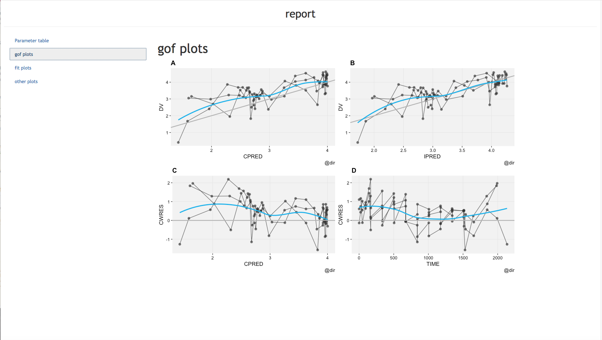

```{r setup, include=FALSE}
knitr::opts_chunk$set(echo = TRUE)
```


# Introduction

This document shows the various ways of running and analysing the case model. 
The first section desribes the data then submitting of models is described and finally the analysis.

# Data

For this case study the Theophylline dataset is used. It is well known, publicly available and included in the `nlmixr` package. The base Theophylline dataset consists of 12 subjects with each 12 concentration measurements between 0 and 24 hours.
    
# Modeling

### Directly in `nlmixr`

In case a model is submitted directly in nlmixr the following can be done:

1. Define your model (using the unified user interface)
2. Import, create and/or adapt the required data
3. Run the `nlmixr` function and if applicable specify model settings

An example for the case study is given below:

```{r eval=FALSE}
library(nlmixr)

# define the model
basemod <- function() {
  ini({
    tka <- .5
    tcl <- -3.2
    tv <- -1
    eta.ka ~ 1
    eta.cl ~ 2
    eta.v ~ 1
    add.err <- 0.1
  })
  model({
    ka <- exp(tka + eta.ka)
    cl <- exp(tcl + eta.cl)
    v <- exp(tv + eta.v)
    linCmt() ~ add(add.err)
  })
}

# run nlmixr with previously defined model (data is present in package!)
fit <- nlmixr(basemod,theo_sd,est="saem")

```

### Using `shinyMixR` in interactive session

In case a model is submitted using shinyMixR, the model should be defined in a separate file. 
This file should contain the model in the same form as needed for running directly in nlmixr. 
However, additional meta data should be provided for settings, the model should be named `runx` (where x is an increasing number) and data used should be indicated.
Models are submitted by default in a separate R session to prevent the current R session from "freezing".

```{r eval=FALSE}
library(shinyMixR)

# Run a model
run_nmx("run1",proj)

# Progress can be read from external file
readLines("shinyMixR/temp/run1.prog.txt")
```
```{r echo=FALSE, message=FALSE}
cat()
cat("-- Example of model with meta data --",readLines("models/run1.r")[1:10],"...",sep="\n")
```

### Using `shinyMixR` interface

The interface can be opened and model(s) can be submitted in the run model widget (see example of app below). Within this widget also the progress can be assessed. 

```{r eval=FALSE}
# -- Be aware that the same model is not already running interactively --
run_shinymixr(launch.browser = TRUE)
```

```{r out.width="\\linewidth", echo=FALSE, message=FALSE}

```


# Analysing
```{r echo=FALSE, message=FALSE}
fit <- readRDS("shinyMixR/run2.res.rds")
```


### Directly in `nlmixr`

High level results from an nlmixr run can be obtained by printing the fit object (within the latest R/Rstudio version important parts are colored in the concole):

```{r}
library(nlmixr)
fit
```

For plotting, it is advised to use the `xpose.nlmixr` package. Results can be easily exported using, e.g. using the `pdf()` or `png()` functions. Examples of some default plots are given below:

```{r eval=FALSE}
library(xpose.nlmixr)
xpdb <- xpose_data_nlmixr(fit)

dv_vs_pred(xpdb) + 
  ylab("Observed Theophylline Concentrations (ng/mL)") + 
  xlab("Population Predicted Theophylline Concentrations (ng/mL)") 
dv_vs_ipred(xpdb) + 
  ylab("Observed Theophylline Concentrations (ug/mL)") + 
  xlab("Individual Predicted Theophylline Concentrations (ng/mL)") 
res_vs_pred(xpdb) + 
  ylab("Conditional Weighted Residuals") +
  xlab("Population Predicted Theophylline Concentrations (ng/mL)")
res_vs_idv(xpdb) + 
  ylab("Conditional Weighted Residuals") + 
  xlab("Time (h)")
prm_vs_iteration(xpdb)
absval_res_vs_idv(xpdb, res = 'IWRES') + 
  ylab("Individual Weighted Residuals") + 
  xlab("Time (h)")
absval_res_vs_pred(xpdb, res = 'IWRES')  + 
  ylab("Individual Weighted Residuals") + 
  xlab("Population Predicted Theophylline Concentrations (ng/mL)")
ind_plots(xpdb, nrow=3, ncol=4) + 
  ylab("Predicted and Observed Theophylline concentrations (ng/mL)") + 
  xlab("Time (h)")
res_distrib(xpdb) + 
  ylab("Density") + 
  xlab("Conditional Weighted Residuals")
nlmixr::vpc(fit,nsim=500, show=list(obs_dv=T),  
            ylab = "Theophylline Concentrations (ng/mL)", xlab = "Time (h)")
```

```{r echo=FALSE, message=FALSE, warning=FALSE}
library(xpose.nlmixr)
xpdb <- xpose_data_nlmixr(fit)

dv_vs_pred(xpdb) + 
  ylab("Observed Theophylline Concentrations (ng/mL)") + 
  xlab("Population Predicted Theophylline Concentrations (ng/mL)") 
dv_vs_ipred(xpdb) + 
  ylab("Observed Theophylline Concentrations (ug/mL)") + 
  xlab("Individual Predicted Theophylline Concentrations (ng/mL)") 
res_vs_pred(xpdb) + 
  ylab("Conditional Weighted Residuals") +
  xlab("Population Predicted Theophylline Concentrations (ng/mL)")
res_vs_idv(xpdb) + 
  ylab("Conditional Weighted Residuals") + 
  xlab("Time (h)")
prm_vs_iteration(xpdb)
absval_res_vs_idv(xpdb, res = 'IWRES') + 
  ylab("Individual Weighted Residuals") + 
  xlab("Time (h)")
absval_res_vs_pred(xpdb, res = 'IWRES')  + 
  ylab("Individual Weighted Residuals") + 
  xlab("Population Predicted Theophylline Concentrations (ng/mL)")
ind_plots(xpdb, nrow=3, ncol=4) + 
  ylab("Predicted and Observed Theophylline concentrations (ng/mL)") + 
  xlab("Time (h)")
res_distrib(xpdb) + 
  ylab("Density") + 
  xlab("Conditional Weighted Residuals")
nlmixr::vpc(fit,nsim=500, show=list(obs_dv=T), 
            ylab = "Theophylline Concentrations (ng/mL)", xlab = "Time (h)")
```

### Using `shinyMixR` in interactive session

For `shinyMixR` there are a couple of functions present in the package to create plots and the `xpose.nlmixr` functions can also be used

```{r eval=FALSE}
gof_plot(fit)             # combine multiple GOF at once
prm_vs_iteration(xpdb)    # xpose.nlmixr functions can be used directly
fit_plot(fit,type="user") # "default ggplot" output can be created
```

Some results can be exported by the function directly. Other output can be xported using the `R3port` package or with the
`pdf()` function e.g.

```{r eval=FALSE}
gof_plot(res,outnm="gofplot.tex",mdlnm="run1")
pl <- prm_vs_iteration(xpdb2); R3port::ltx_plot(pl,out="plot.tex")
pdf("results.pdf"); fit_plot(res); dev.off()
```

### Using `shinyMixR` interface

There are widgets for a few default plots, user scripts are possible in the script widget
plots are by default saved in the analyis folder and made available in the interface
The post processing scripts can also be used in an interactive session. In these cases the model 
should be provided, e.g.

```{r eval=FALSE}
models <- "run1"
source("./scripts/postprocessing script.r")
```

When creating the plots in the interface, reports can be generated in pdf or html format:

```{r out.width="\\linewidth", echo=FALSE, message=FALSE}

```


